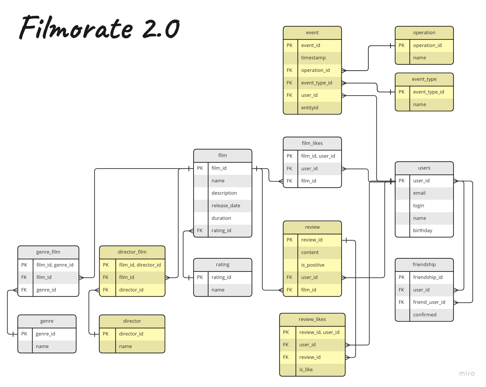

# java-filmorate
Template repository for Filmorate project.

Database creation and select requests
-------------------

-> Database creation & filling in

~~~~~~~~~
CREATE TABLE IF NOT EXISTS rating (
  rating_id integer generated by default as identity primary key,
  name varchar(30) NOT NULL
);

 CREATE TABLE IF NOT EXISTS genre (
  genre_id integer generated by default as identity primary key,
  name VARCHAR(30) NOT NULL
);

CREATE TABLE IF NOT EXISTS film (
  film_id integer generated by default as identity primary key,
  name VARCHAR(30) NOT NULL,
  description VARCHAR(200) NOT NULL,
  release_date DATE NOT NULL,
  duration integer NOT NULL,
  rating_id integer NOT NULL REFERENCES rating(rating_id)
);

CREATE TABLE IF NOT EXISTS genre_film (
  film_id integer NOT NULL REFERENCES film(film_id),
  genre_id integer NOT NULL REFERENCES genre(genre_id),
  PRIMARY KEY (film_id, genre_id)
);

CREATE TABLE IF NOT EXISTS users (
  user_id integer generated by default as identity primary key,
  email VARCHAR(30) NOT NULL,
  login VARCHAR(30) NOT NULL,
  name VARCHAR(30) NOT NULL,
  birthday DATE NOT NULL
);

CREATE TABLE IF NOT EXISTS film_likes (
  film_id integer NOT NULL REFERENCES film(film_id),
  user_id integer NOT NULL REFERENCES users(user_id),
  PRIMARY KEY(film_id, user_id)
);

CREATE TABLE IF NOT EXISTS review (
review_id integer generated by default as identity primary key,
content VARCHAR(100) NOT NULL,
is_positive boolean NOT NULL,
user_id integer NOT NULL REFERENCES users(user_id),
film_id integer NOT NULL REFERENCES film(film_id)
);

CREATE TABLE IF NOT EXISTS review_likes (
review_id integer NOT NULL REFERENCES review(review_id),
user_id integer NOT NULL REFERENCES users(user_id),
is_like boolean NOT NULL DEFAULT 0,
PRIMARY KEY(review_id, user_id)
);

CREATE TABLE IF NOT EXISTS operation (
  operation_id integer generated by default as identity primary key,
  name varchar(30) NOT NULL
);

CREATE TABLE IF NOT EXISTS event_type (
event_type_id integer generated by default as identity primary key,
name varchar(30) NOT NULL
);

CREATE TABLE IF NOT EXISTS event (
event_id integer generated by default as identity primary key,
timestamp timestamp NOT NULL DEFAULT NOW(),
operation_id integer NOT NULL REFERENCES operation(operation_id),
event_type_id integer NOT NULL REFERENCES event_type(event_type_id),
user_id integer NOT NULL REFERENCES users(user_id),
entity_id integer NOT NULL
);

CREATE TABLE IF NOT EXISTS friendship (
  friendship_id integer generated by default as identity primary key,
  user_id integer NOT NULL REFERENCES users(user_id),
  friend_user_id integer NOT NULL REFERENCES users(user_id),
  confirmed boolean NOT NULL DEFAULT 0
);

CREATE TABLE IF NOT EXISTS director (
  director_id integer generated by default as identity primary key,
  name VARCHAR(30) NOT NULL
);

CREATE TABLE IF NOT EXISTS director_film (
  film_id integer NOT NULL REFERENCES film(film_id),
  director_id integer NOT NULL REFERENCES director(director_id),
  PRIMARY KEY (film_id, director_id)
);

DELETE FROM FRIENDSHIP ;
ALTER TABLE FRIENDSHIP ALTER COLUMN friendship_id RESTART WITH 1;
DELETE FROM FILM_LIKES ;
DELETE FROM REVIEW_LIKES ;
DELETE FROM REVIEW ;
ALTER TABLE REVIEW ALTER COLUMN review_id RESTART WITH 1;
DELETE FROM EVENT ;
ALTER TABLE EVENT ALTER COLUMN event_id RESTART WITH 1;
DELETE FROM OPERATION ;
ALTER TABLE OPERATION ALTER COLUMN operation_id RESTART WITH 1;
DELETE FROM EVENT_TYPE ;
ALTER TABLE EVENT_TYPE ALTER COLUMN event_type_id RESTART WITH 1;
DELETE FROM USERS ;
ALTER TABLE USERS ALTER COLUMN user_id RESTART WITH 1;
DELETE FROM GENRE_FILM ;
DELETE FROM GENRE ;
ALTER TABLE GENRE ALTER COLUMN genre_id RESTART WITH 1;
DELETE FROM director_film ;
DELETE FROM DIRECTOR ;
ALTER TABLE DIRECTOR ALTER COLUMN director_id RESTART WITH 1;
DELETE FROM FILM ;
ALTER TABLE FILM ALTER COLUMN film_id RESTART WITH 1;
DELETE FROM RATING ;
ALTER TABLE RATING ALTER COLUMN rating_id RESTART WITH 1;

INSERT INTO RATING (name) values('G'), ('PG'), ('PG-13'), ('R'), ('NC-17');

INSERT INTO GENRE (name) values('Комедия'), ('Драма'), ('Мультфильм'), ('Триллер'), ('Документальный'), ('Боевик');

INSERT INTO EVENT_TYPE (name) values('LIKE'), ('REVIEW'), ('FRIEND');

INSERT INTO OPERATION (name) values('REMOVE'), ('ADD'), ('UPDATE');
~~~~~~~~~~~~~~~~~~~~~

-> Select queries from created database

1) Get friends of user 2
------------------------ 

~~~~~
select 
  u.* 
from 
  users u 
where 
  u.user_id in (
    select 
      f.friend_user_id 
    from 
      friendship f 
    where 
      f.user_id = 2 
      and f.confirmed = true 
    union 
    select 
      f.user_id 
    from 
      friendship f 
    where 
      f.friend_user_id = 2 
      and f.confirmed = true 
    union 
    select 
      f.friend_user_id 
    from 
      friendship f 
    where 
      f.user_id = 2 
      and f.confirmed = false
  );
~~~~~

2) Get common friends of users 1 and 2
--------------------------------------

~~~~
select 
  u.* 
from 
  users u 
where 
  u.user_id in (
    select 
      all_friends_for_pair.user_id 
    from 
      (
        select 
          f.user_id 
        from 
          friendship f 
        where 
          (
            f.friend_user_id = 1 
            or f.friend_user_id = 2
          ) 
        union all 
        select 
          f.friend_user_id 
        from 
          friendship f 
        where 
          (
            f.user_id = 1 
            or f.user_id = 2
          )
      ) all_friends_for_pair 
    group by 
      all_friends_for_pair.user_id 
    having 
      count(*) > 1
  );
~~~~

3) Get all users
----------------
~~~~
select * from users;
~~~~

4) Get user with id 1
---------------------
~~~~
select * from user where user_id = 1;
~~~~

5) Get film with id 1
---------------------
~~~~
select * from film where film_id = 1;
~~~~

6) Find most popular films (show all films whether or not liked, ordered by amount of likes)
--------------------------
~~~~
select 
  f.film_id, 
  f.name, 
  f.description, 
  f.release_date, 
  f.duration, 
  r.rating_id as rating_id, 
  r.name as rating_name 
from 
  film f 
  inner join rating r using(rating_id) 
  left join film_likes fl using(film_id) 
group by 
  f.film_id 
order by 
  count(distinct fl.user_id) DESC 
limit 
  10;
~~~~